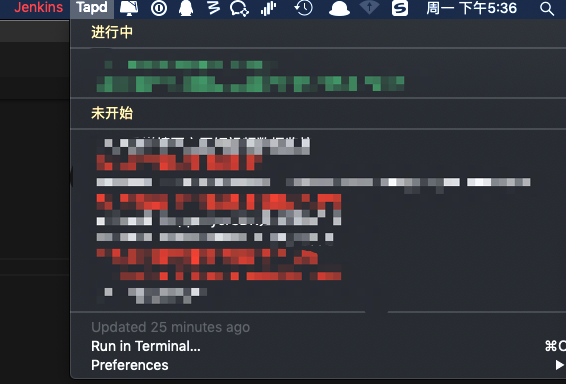

# BitBar-Tapd-Plugin
A Bitbar Plugin , Show current status of Undo jobs on a Tapd instance. Clicks navigate to task Detail.


## 插件使用
1.安装BitBar

2.将脚本拖入插件目录

3.插件目录下执行 `chmod -R 777 getTapdTimes.30m.py` 

3.安装脚本环境(python3,selenium,chromedriver)

4.红色状态为已逾期 绿色正在进行 白色为未开始

## 注意事项
- 在打开系统防火墙时,可能每次调用脚本都会弹出确权窗口
- 第一次进入Tapd可能要去输入验证码,此时注释掉 `chrome_options.add_argument('--headless')` ,并使用`time.sleep(30)` 手动输入一次即可,以后会有cookie来维持session
- 因为使用的是xpath定位,对页面元素布局要求比较高,当tapd布局更改时脚本可能失效
- 用户名和密码为必填项, 任务列表url可选填


### Must config 
```python
user_email = u"XXXXXXXXXXXXX@banggood.com"

user_password = u"XXXXXXXXXXXXXXX"

task_id = u"xxxxxxx"

user_config_url = u"https://www.tapd.cn/"+task_id+"/prong/tasks?Model_name=Task&perpage=20&sort_name=status&order=ASC"
```

### 安装chromedriver
- 下载chromedriver安装包：https://sites.google.com/a/chromium.org/chromedriver/downloads
```shell
- unzip chromedriver_map.zip 
- mv chromedriver /usr/local/bin
- cd /usr/local/bin && chmod a+x chromedirver
- /usr/local/bin/chromedriver
```

# 插件截图
